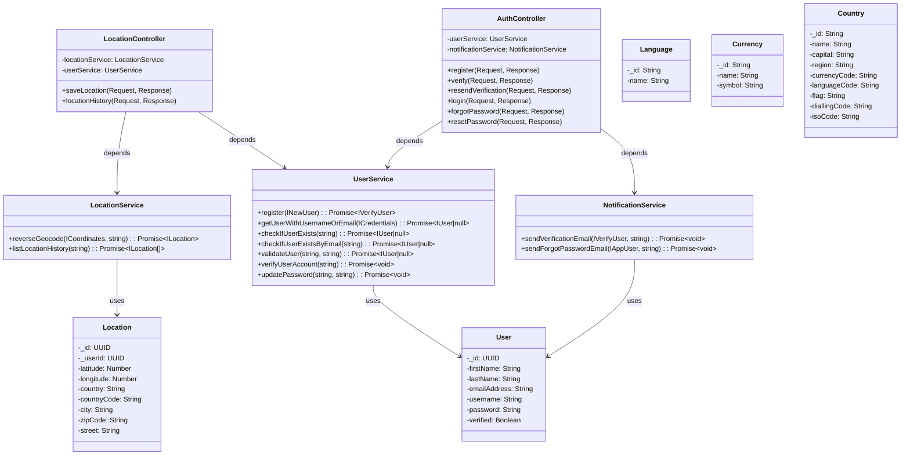

### Class Diagram (Mermaid)

### README (Markdown)

# lt-services/src Package Overview

## Services

- **NotificationService**: Handles sending verification and password reset emails.
- **UserService**: Manages user registration, authentication, and user data retrieval.
- **LocationService**: Provides functionality for geocoding and managing user location history.

## Controllers

- **LocationController**: Exposes endpoints for saving user locations and retrieving location history.
- **AuthController**: Handles user authentication, including registration, login, verification, and password resets.

## Models

- **User**: Represents user data within the system.
- **Location**: Represents a user's location data.
- **Language**: Represents supported languages.
- **Currency**: Represents supported currencies.
- **Country**: Represents supported countries.

## Use Cases

- User registration, login, and account verification.
- Password reset and account recovery.
- Saving user locations and retrieving location history.
